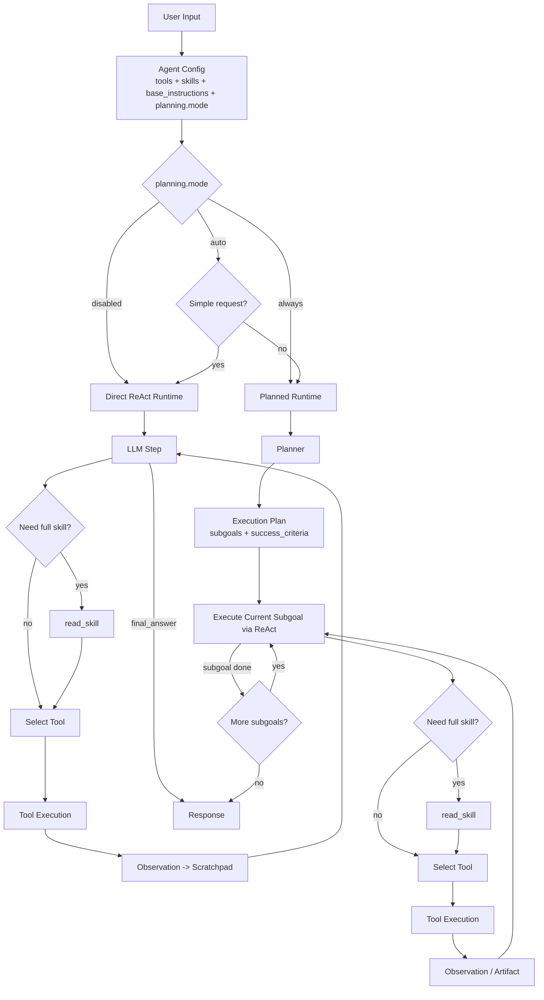
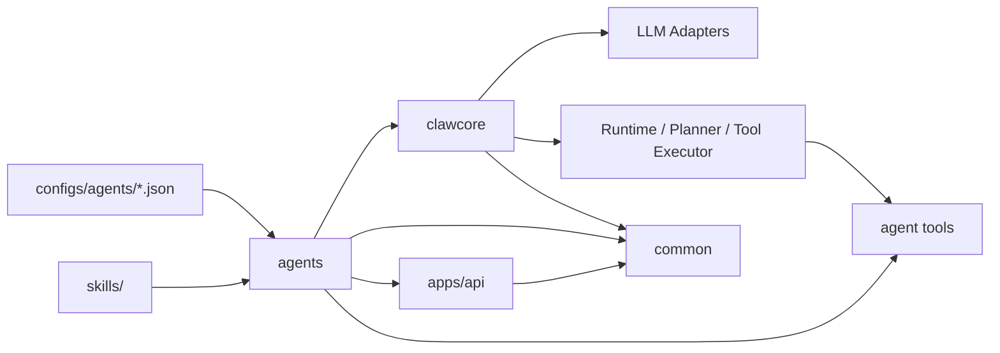

# agent-claw

Python agent framework with a ReAct runtime, reusable skills/tools, and API-facing agents configured from JSON.

## Overview

- `common`: shared infrastructure such as logging, tracing, and utility helpers
- `clawcore`: runtime loop, planner/LLM adapters, and tool execution
- `agents`: business-facing agents built on top of `clawcore`





## Quick Start

```bash
python3 -m venv .venv
source .venv/bin/activate
pip install -e '.[dev]'
cp .env.example .env
python3 -m apps.api.run
```

Set `OPENAI_API_KEY` in `.env` before running OpenAI-backed agents.

## Environment

Common variables:

- `OPENAI_BASE_URL`
- `TAVILY_API_KEY`
- `TAVILY_API_URL`
- `SMTP_HOST`
- `SMTP_PORT`
- `SMTP_USERNAME`
- `SMTP_PASSWORD`
- `SMTP_FROM`
- `SMTP_USE_TLS`
- `SMTP_USE_SSL`
- `AGENT_CLAW_AGENTS_DIR`
- `AGENT_CLAW_API_HOST`
- `AGENT_CLAW_API_PORT`

Gmail SMTP example for `send_email`:

```env
SMTP_HOST=smtp.gmail.com
SMTP_PORT=587
SMTP_USERNAME=yourname@gmail.com
SMTP_PASSWORD=your_gmail_app_password
SMTP_FROM=yourname@gmail.com
SMTP_USE_TLS=true
SMTP_USE_SSL=false
```

`SMTP_PASSWORD` should be a Gmail App Password, not your normal account password.

## Agent Configs

Agents are configured from `configs/agents/*.json`.

- `openai_runtime.json`: minimal OpenAI-compatible runtime agent
- `weather.json`: weather-focused direct agent
- `research_email_auto.json`: auto-plan agent using weather/research/email tools

Common fields:

- `type`
- `model`
- `tools`
- `skills`
- `base_instructions`
- `max_steps`
- `include_read_skill`
- `temperature`
- `planning.mode`

Built-in tools are loaded by default. The `tools` field is for agent-level tools
defined under `src/agents/tools/`.

## API

Run locally:

```bash
python3 -m apps.api.run
```

Endpoints:

- `GET /health`
- `GET /agents`
- `POST /runs`
- `POST /runs/debug`

`/runs/debug` returns the final answer plus runtime state such as `scratchpad`,
`tool_results`, `plan`, `events`, `trace`, and `token_usage`.

Example:

```bash
curl -X POST http://127.0.0.1:8000/runs/debug \
  -H 'Content-Type: application/json' \
  -d '{"agent_id":"weather","user_input":"香港的天气怎么样？"}'
```

## Skills

Skills live under `skills/` and are versioned with the repo.

Install a skill from GitHub:

```bash
python examples/install_skill.py \
  "https://github.com/openclaw/openclaw/tree/main/skills/weather" \
  --skills-root skills
```

With a proxy:

```bash
python examples/install_skill.py \
  "https://github.com/openclaw/openclaw/tree/main/skills/weather" \
  --skills-root skills \
  --proxy http://127.0.0.1:7890
```
