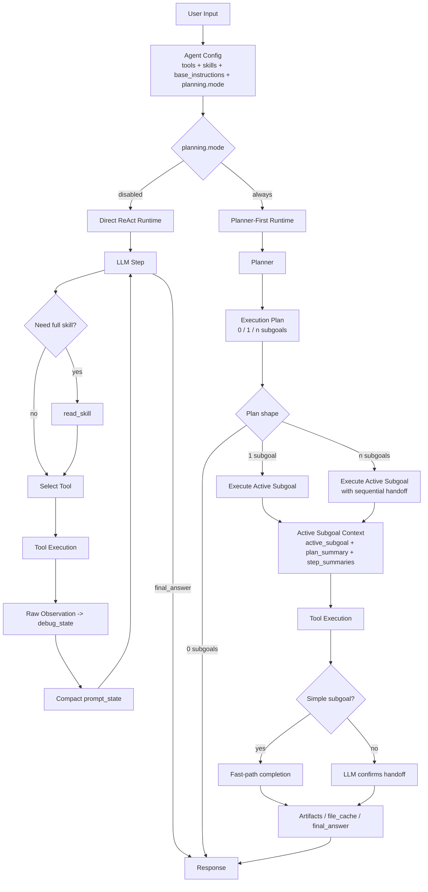
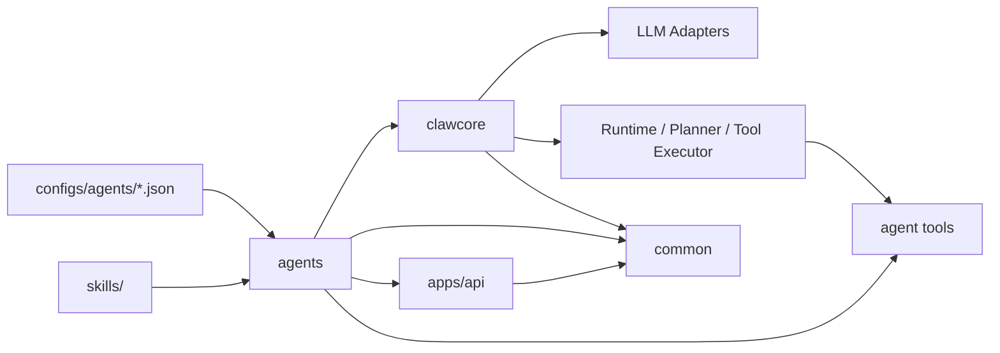

# 智爪

一个基于 Python 的 Agent 框架，内置 ReAct 运行时，支持可复用的技能与工具，并通过 JSON 配置面向 API 的业务 Agent。

## Overview

- `common`: shared infrastructure such as logging, tracing, and utility helpers
- `clawcore`: runtime loop, planner/LLM adapters, and tool execution
- `agents`: business-facing agents built on top of `clawcore`

## 设计亮点

- 规划器支持 `0 / 1 / n` 三种输出形态，可以直接回答、执行单步任务，或拆成多子目标顺序执行。
- planner-first 模式下，运行时只暴露当前 `active_subgoal` 作为可执行边界，用户原始请求保留为背景约束，不再驱动越界执行。
- executor 看到的是压缩后的上下文，而不是完整原始历史；重点保留 `plan_summary`、`step_summaries`、精简 observation、artifacts 和缓存文件内容。
- 运行时同时维护 `prompt_state` 和 `debug_state`：前者服务模型输入控 token，后者保留原始 scratchpad、tool results、events 和 trace 便于排查。
- 成功的 `write` 会把内容写入 `file_cache`，后续子目标可以直接复用，避免重复 `read` 文件。
- 对简单单工具子目标支持 fast-path completion，运行时可直接收口，不必额外再花一轮 LLM 去确认成功。
- Tavily 长结果在回灌给 executor 前会先做摘要，既保留调试信息，也显著降低 prompt token 消耗。

## 现实边界

这个项目刻意保留了当前 Agent 系统的真实工程约束，而不是把它包装成“已经稳定可用的通用智能体”。

当前这类 Agent 普遍存在以下共性问题：

- `OOD` 明显：只要用户表达方式、任务结构、站点形态或工具返回结果超出已见模式，性能就会快速下降。
- 工具质量决定上限：像 Tavily 这样的通用搜索工具一旦返回公司主页、聚合页、脏摘要或时间不准的页面，最终回答质量会被明显拖低。
- 长尾场景脆弱：系统在常见任务上可能表现不错，但在边界条件、弱约束任务、低质量检索、混合目标请求中容易失真。
- 收口困难：Agent 往往会把“没有找到”误判为“应该继续再试一次”，导致反复改 query、消耗 token，甚至撞上 `max_steps`。
- 平均表现不等于可靠：这类系统更像 Tesla FSD 面对自动驾驶长尾问题时的状态，主干能力很强，但异常场景和稳定边界仍然远未解决。

因此，本项目更适合被理解为：

- 一个用于研究 planner-first runtime、skills、tool execution 和调试链路的实验框架
- 一个“半自动研究助理 / 任务编排原型”，而不是已经解决长尾可靠性的生产级 Agent 平台

README 中记录的各种 prompt、skill 和工具收敛策略，本质上都是在降低失败率，而不是根治当前 Agent 范式的共性问题。

### 运行流程图



### 模块关系图



## Quick Start

```bash
python3 -m venv .venv
source .venv/bin/activate
pip install -e '.[dev]'
cp .env.example .env
python3 -m apps.api.run
```

Set `OPENAI_API_KEY` in `.env` before running OpenAI-backed agents.

## Environment

Common variables:

- `OPENAI_BASE_URL`
- `TAVILY_API_KEY`
- `TAVILY_API_URL`
- `SMTP_HOST`
- `SMTP_PORT`
- `SMTP_USERNAME`
- `SMTP_PASSWORD`
- `SMTP_FROM`
- `SMTP_USE_TLS`
- `SMTP_USE_SSL`
- `AGENT_CLAW_AGENTS_DIR`
- `AGENT_CLAW_API_HOST`
- `AGENT_CLAW_API_PORT`

Gmail SMTP example for `send_email`:

```env
SMTP_HOST=smtp.gmail.com
SMTP_PORT=587
SMTP_USERNAME=yourname@gmail.com
SMTP_PASSWORD=your_gmail_app_password
SMTP_FROM=yourname@gmail.com
SMTP_USE_TLS=true
SMTP_USE_SSL=false
```

`SMTP_PASSWORD` should be a Gmail App Password, not your normal account password.

## Agent Configs

Agents are configured from `configs/agents/*.json`.

- `openai_runtime.json`: minimal OpenAI-compatible runtime agent
- `weather.json`: weather-focused direct agent
- `research_email_plan_first.json`: planner-first agent using weather/research/email tools

Common fields:

- `type`
- `model`
- `tools`
- `skills`
- `base_instructions`
- `max_steps`
- `include_read_skill`
- `temperature`
- `planning.mode`

Planner-enabled agents now use planner-first execution. The planner may return:

- `0` subgoals for a direct answer
- `1` subgoal for a single executable task
- `n` subgoals for multi-step work

Built-in tools are loaded by default. The `tools` field is for agent-level tools
defined under `src/agents/tools/`.

## API

Run locally:

```bash
python3 -m apps.api.run
```

Endpoints:

- `GET /health`
- `GET /agents`
- `POST /runs`
- `POST /runs/debug`

`/runs/debug` returns the final answer plus both compact and full-fidelity runtime
state:

- `prompt_state`: the compact executor-facing state, including the current plan,
  active subgoal, prompt observations, and artifacts
- `debug_state`: raw `scratchpad`, `tool_results`, `events`, `trace`, and other
  debugging details
- `plan`, `artifacts`, and `token_usage`: normalized top-level views for API
  consumers

Example:

```bash
curl -X POST http://127.0.0.1:8000/runs/debug \
  -H 'Content-Type: application/json' \
  -d '{"agent_id":"weather","user_input":"香港的天气怎么样？"}'
```

## Skills

Skills live under `skills/` and are versioned with the repo.

Install a skill from GitHub:

```bash
python examples/install_skill.py \
  "https://github.com/openclaw/openclaw/tree/main/skills/weather" \
  --skills-root skills
```

With a proxy:

```bash
python examples/install_skill.py \
  "https://github.com/openclaw/openclaw/tree/main/skills/weather" \
  --skills-root skills \
  --proxy http://127.0.0.1:7890
```
